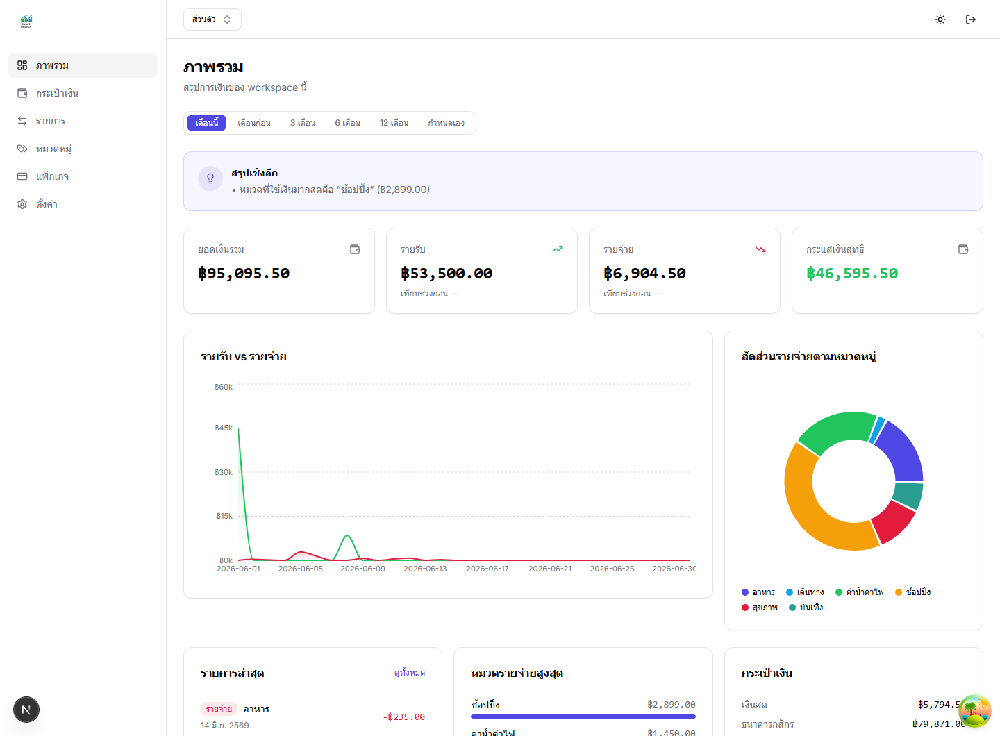
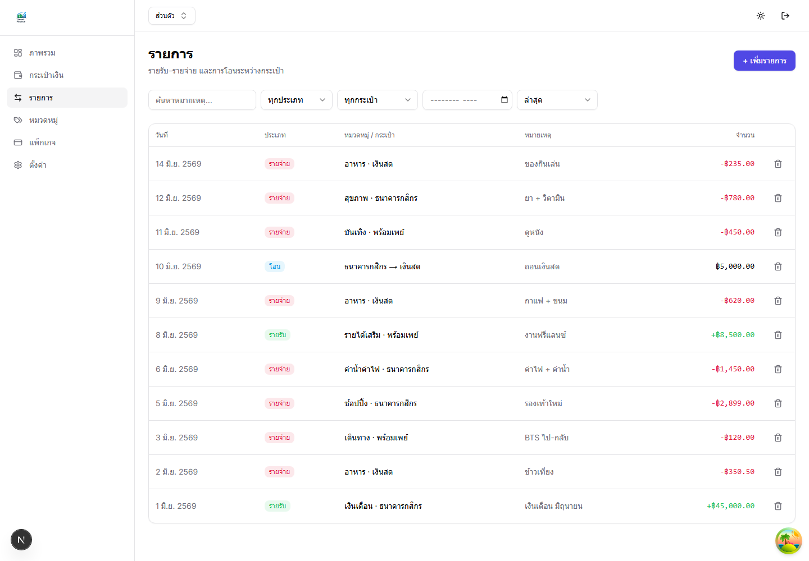
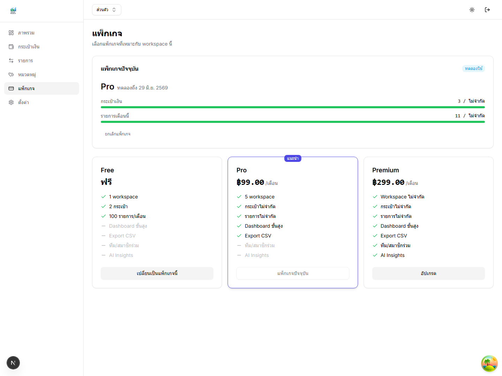
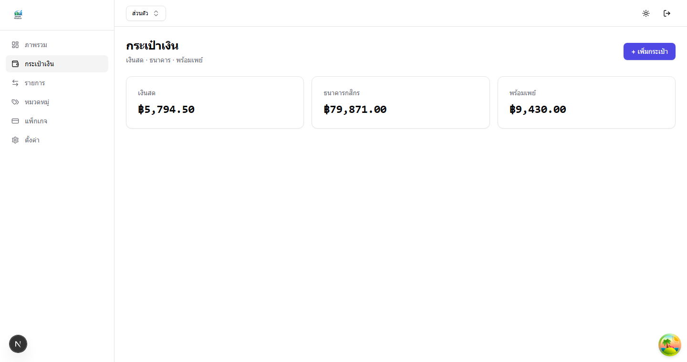
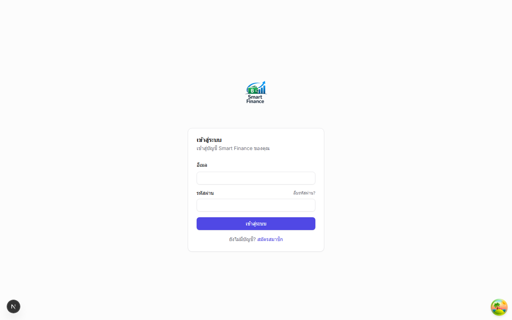

<div align="center">
  

  # Smart Finance SaaS

  ระบบจัดการรายรับ–รายจ่าย แบบ Multi-Tenant SaaS สำหรับบุคคลทั่วไปและร้านค้า/ธุรกิจขนาดเล็ก
</div>

---

## ✨ Features

- 🔐 **Authentication** — JWT access + refresh token rotation, Argon2, Google OAuth, ลืมรหัสผ่าน
- 🏢 **Multi-Tenant** — แยกข้อมูลด้วย Workspace (personal / business) + onboarding wizard
- 💸 **Transaction Engine** — รายรับ / รายจ่าย / โอนระหว่างกระเป๋า + filter + cursor pagination
- 👛 **Wallets** — หลายกระเป๋า (เงินสด / ธนาคาร / พร้อมเพย์) + คำนวณยอดอัตโนมัติ
- 📊 **Dashboard** — กราฟ (Recharts), insights, สรุปตามช่วงเวลา
- 💎 **Subscription** — Free / Pro / Business / Premium + plan limit enforcement + PRO trial 14 วัน

### 🏪 Business Workspace (สำหรับร้านค้า/ธุรกิจ)
- 👥 **Team Management** — เชิญสมาชิกทางอีเมล, บทบาท Owner / Manager / Staff, permission matrix
- 📈 **Business Dashboard** — รายได้รายวัน/เดือน, กำไรสุทธิ, อัตรากำไร, แนวโน้ม, หมวดหมู่สูงสุด
- 📑 **Business Reports** — รายงานรายได้ / ค่าใช้จ่าย / กำไร-ขาดทุน + Export **PDF / Excel**
- 🕑 **Activity Log** — ติดตามว่าใคร สร้าง/แก้/ลบ รายการ (timeline + filter)
- 🤖 **AI Insights** (Premium) — วิเคราะห์แนวโน้ม + คำแนะนำอัตโนมัติ (rule-based, พร้อมต่อ Claude)
- 🛠️ **Admin Dashboard** — จัดการผู้ใช้ + MRR / ARR / growth stats

## 📚 Documentation

| เอกสาร | เนื้อหา |
|--------|---------|
| [docs/ENVIRONMENT.md](docs/ENVIRONMENT.md) | Environment variables ทั้ง backend + frontend |
| [docs/DEPLOYMENT.md](docs/DEPLOYMENT.md) | Production runbook — Supabase · Railway · Vercel |
| [docs/MIGRATION_GUIDE.md](docs/MIGRATION_GUIDE.md) | การรัน Prisma migration บน production |
| [docs/API.md](docs/API.md) | API reference + Role Permission Matrix |
| [docs/SECURITY_CHECKLIST.md](docs/SECURITY_CHECKLIST.md) | Security checklist ก่อน go-live |
| [docs/BACKUP_RECOVERY.md](docs/BACKUP_RECOVERY.md) | Backup & recovery |
| [docs/MONITORING.md](docs/MONITORING.md) | Monitoring & health checks |
| [docs/RELEASE_NOTES.md](docs/RELEASE_NOTES.md) | Release notes v1.0 |

## 📸 Screenshots

### 📊 Dashboard
ภาพรวมการเงิน · กราฟรายรับ-รายจ่าย · สัดส่วนหมวดหมู่ · insights อัจฉริยะ



<table>
  <tr>
    <td width="50%"><b>💸 Transactions</b><br/></td>
    <td width="50%"><b>💎 Subscription &amp; Plans</b><br/></td>
  </tr>
  <tr>
    <td width="50%"><b>👛 Wallets</b><br/></td>
    <td width="50%"><b>🔐 Login</b><br/></td>
  </tr>
</table>

## 🧱 Tech Stack

| ส่วน | เทคโนโลยี |
|------|-----------|
| Frontend | Next.js 15 (App Router) · TypeScript · Tailwind · Shadcn UI · Zustand · TanStack Query |
| Backend | NestJS · Prisma · JWT (Passport) · Google OAuth |
| Database | PostgreSQL (Supabase) |
| Charts | Recharts |
| Export | pdfkit (PDF) · exceljs (Excel) |
| Hosting | Railway (API) · Vercel (Web) |

## 📁 Structure

```
.
├── backend/     # NestJS API (Clean Architecture)
├── frontend/    # Next.js app (Feature-based)
└── docs/        # Architecture & API contracts
```

## 🚀 Getting Started

### Prerequisites
- Node.js 20+
- PostgreSQL 14+ (หรือ Docker)

### Backend
```bash
cd backend
npm install
cp .env.example .env          # ตั้ง DATABASE_URL + JWT secrets
npx prisma generate
npx prisma migrate deploy     # หรือ prisma db push สำหรับ dev
npm run db:seed               # plans + system categories
npm run start:dev             # http://localhost:8000/api/v1
```

### Frontend
```bash
cd frontend
npm install
cp .env.local.example .env.local   # ตั้ง NEXT_PUBLIC_API_URL
npm run dev                        # http://localhost:3000
```

## 📄 License

MIT
