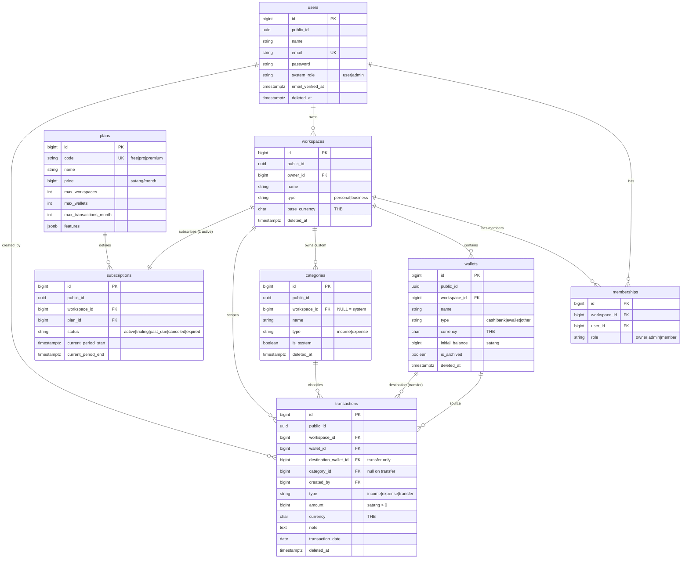

# Smart Finance SaaS — Database Schema (Step 2)

> สถานะ: 🟡 รออนุมัติ
> Database: PostgreSQL · ยึดตาม `01-architecture.md` (ADR-01..05)

---

## 0. หลักการออกแบบ (Design Principles)

| หลักการ | รายละเอียด |
|---------|-----------|
| Primary Key | `id` = **BIGINT identity** (เร็ว, FK เบา) |
| Public ID | ตารางที่ API/URL อ้างถึง เพิ่ม `public_id UUID` (กัน IDOR/enumeration) |
| Money | `BIGINT` หน่วย **สตางค์** (เช่น 100.50 บาท = `10050`) |
| Currency | `CHAR(3)` default `'THB'` — เผื่อ multi-currency |
| Timestamp | `TIMESTAMPTZ` (timezone-aware) เสมอ |
| Enum | **Prisma native enum** → Postgres enum (type-safe ทั้ง DB + TS). หมายเหตุ `CHECK in (...)` ในตารางด้านล่าง = ค่าที่อนุญาตของ enum นั้น |
| Soft Delete | `deleted_at TIMESTAMPTZ NULL` + partial index `WHERE deleted_at IS NULL` |
| Tenant Scope | ทุกตารางธุรกิจมี `workspace_id` + composite index นำหน้าด้วย `workspace_id` |
| Naming | snake_case, ชื่อตารางพหูพจน์ |

---

## 1. ER Diagram



---

## 2. ตารางทั้งหมด (Tables Overview)

| # | ตาราง | หน้าที่ | Tenant-scoped? |
|---|-------|---------|----------------|
| 1 | `users` | บัญชีล็อกอิน + platform role | — (global) |
| 2 | `workspaces` | Tenant boundary (personal/business) | เป็น tenant เอง |
| 3 | `memberships` | user ↔ workspace + role | ✅ |
| 4 | `wallets` | กระเป๋าเงิน (cash/bank/ewallet) | ✅ |
| 5 | `categories` | หมวดหมู่ (system + custom) | ✅ / NULL=system |
| 6 | `transactions` | รายการ income/expense/transfer | ✅ |
| 7 | `plans` | แคตตาล็อกแพ็กเกจ (reference) | — (global) |
| 8 | `subscriptions` | การสมัครแพ็กเกจของ workspace | ✅ per-workspace |
| 9 | `password_reset_tokens` | token ลืมรหัสผ่าน (Laravel) | — |

> หมายเหตุ billing: V1 บันทึกแค่ `subscriptions` (สถานะแพ็กเกจ). ตาราง `payments`/`invoices` สำหรับ payment gateway จริง (Stripe/Omise) เป็น **future** — ออกแบบให้ subscription เชื่อมต่อได้ภายหลังโดยไม่รื้อ

---

## 3. รายละเอียด Columns ทุกตาราง

### 3.1 `users`
| Column | Type | Constraint | หมายเหตุ |
|--------|------|-----------|----------|
| id | BIGINT | PK, identity | |
| public_id | UUID | UNIQUE, default gen_random_uuid() | ใช้ใน API |
| name | VARCHAR(120) | NOT NULL | |
| email | VARCHAR(255) | NOT NULL, UNIQUE | |
| password | VARCHAR(255) | NOT NULL | hash (bcrypt/argon2) |
| system_role | VARCHAR(20) | NOT NULL, default `'user'`, CHECK in (user, admin) | platform admin |
| email_verified_at | TIMESTAMPTZ | NULL | |
| last_active_workspace_id | BIGINT | NULL, FK→workspaces | จำ workspace ล่าสุด |
| created_at / updated_at | TIMESTAMPTZ | | |
| deleted_at | TIMESTAMPTZ | NULL | soft delete |

### 3.2 `workspaces`
| Column | Type | Constraint | หมายเหตุ |
|--------|------|-----------|----------|
| id | BIGINT | PK | |
| public_id | UUID | UNIQUE | |
| owner_id | BIGINT | NOT NULL, FK→users | ผู้สร้าง/เจ้าของ |
| name | VARCHAR(120) | NOT NULL | เช่น "ส่วนตัว", "ร้านชา" |
| type | VARCHAR(20) | NOT NULL, CHECK in (personal, business) | |
| base_currency | CHAR(3) | NOT NULL, default `'THB'` | |
| settings | JSONB | NOT NULL, default `'{}'` | ตั้งค่าเฉพาะ workspace |
| created_at / updated_at / deleted_at | TIMESTAMPTZ | | |

### 3.3 `memberships`
| Column | Type | Constraint | หมายเหตุ |
|--------|------|-----------|----------|
| id | BIGINT | PK | |
| workspace_id | BIGINT | NOT NULL, FK→workspaces | |
| user_id | BIGINT | NOT NULL, FK→users | |
| role | VARCHAR(20) | NOT NULL, CHECK in (owner, admin, member) | |
| created_at / updated_at | TIMESTAMPTZ | | |
| | | **UNIQUE(workspace_id, user_id)** | กันซ้ำ |

### 3.4 `wallets`
| Column | Type | Constraint | หมายเหตุ |
|--------|------|-----------|----------|
| id | BIGINT | PK | |
| public_id | UUID | UNIQUE | |
| workspace_id | BIGINT | NOT NULL, FK→workspaces | |
| name | VARCHAR(120) | NOT NULL | "เงินสด", "พร้อมเพย์" |
| type | VARCHAR(20) | NOT NULL, CHECK in (cash, bank, ewallet, other) | |
| currency | CHAR(3) | NOT NULL, default `'THB'` | เผื่อ multi-currency ต่อ wallet |
| initial_balance | BIGINT | NOT NULL, default 0 | ยอดยกมา (สตางค์) |
| color | VARCHAR(9) | NULL | hex สี UI |
| icon | VARCHAR(40) | NULL | |
| is_archived | BOOLEAN | NOT NULL, default false | |
| created_at / updated_at / deleted_at | TIMESTAMPTZ | | |

> **ยอดคงเหลือ wallet ไม่เก็บเป็นคอลัมน์** (กัน data drift) → คำนวณ = `initial_balance + Σincome − Σexpense + Σtransfer_in − Σtransfer_out`. ถ้าข้อมูลโตมากค่อยเพิ่ม `cached_balance` + trigger ภายหลัง

### 3.5 `categories`
| Column | Type | Constraint | หมายเหตุ |
|--------|------|-----------|----------|
| id | BIGINT | PK | |
| public_id | UUID | UNIQUE | |
| workspace_id | BIGINT | **NULL** , FK→workspaces | NULL = system default |
| name | VARCHAR(80) | NOT NULL | |
| type | VARCHAR(20) | NOT NULL, CHECK in (income, expense) | |
| icon | VARCHAR(40) | NULL | |
| color | VARCHAR(9) | NULL | |
| is_system | BOOLEAN | NOT NULL, default false | |
| sort_order | INT | NOT NULL, default 0 | |
| created_at / updated_at / deleted_at | TIMESTAMPTZ | | |

### 3.6 `transactions` (ตารางหลัก)
| Column | Type | Constraint | หมายเหตุ |
|--------|------|-----------|----------|
| id | BIGINT | PK | |
| public_id | UUID | UNIQUE | |
| workspace_id | BIGINT | NOT NULL, FK→workspaces | tenant scope |
| wallet_id | BIGINT | NOT NULL, FK→wallets | wallet ต้นทาง/ที่ได้รับผล |
| destination_wallet_id | BIGINT | NULL, FK→wallets | **เฉพาะ transfer** |
| category_id | BIGINT | NULL, FK→categories | NULL เมื่อ transfer |
| created_by | BIGINT | NOT NULL, FK→users | ผู้บันทึก |
| type | VARCHAR(20) | NOT NULL, CHECK in (income, expense, transfer) | |
| amount | BIGINT | NOT NULL, CHECK (amount > 0) | สตางค์ |
| currency | CHAR(3) | NOT NULL, default `'THB'` | |
| note | TEXT | NULL | |
| transaction_date | DATE | NOT NULL | วันที่ทางบัญชี (ผู้ใช้เลือก) |
| created_at / updated_at / deleted_at | TIMESTAMPTZ | | |

**CHECK constraints เชิงตรรกะ (table-level):**
- ถ้า `type = 'transfer'` → `destination_wallet_id IS NOT NULL` และ `category_id IS NULL` และ `destination_wallet_id <> wallet_id`
- ถ้า `type IN ('income','expense')` → `destination_wallet_id IS NULL`

### 3.7 `plans`
| Column | Type | Constraint | หมายเหตุ |
|--------|------|-----------|----------|
| id | BIGINT | PK | |
| code | VARCHAR(20) | NOT NULL, UNIQUE, CHECK in (free, pro, premium) | |
| name | VARCHAR(60) | NOT NULL | |
| price | BIGINT | NOT NULL, default 0 | สตางค์/เดือน |
| max_workspaces | INT | NULL | NULL = ไม่จำกัด |
| max_wallets | INT | NULL | ต่อ workspace |
| max_transactions_month | INT | NULL | NULL = ไม่จำกัด |
| features | JSONB | NOT NULL, default `'{}'` | flags เช่น export, advanced_report |
| is_active | BOOLEAN | NOT NULL, default true | |
| created_at / updated_at | TIMESTAMPTZ | | |

### 3.8 `subscriptions`
| Column | Type | Constraint | หมายเหตุ |
|--------|------|-----------|----------|
| id | BIGINT | PK | |
| public_id | UUID | UNIQUE | |
| workspace_id | BIGINT | NOT NULL, FK→workspaces | **แต่ละ workspace ใช้ plan ต่างกันได้** (personal=free, ร้านชา=pro, ...) |
| plan_id | BIGINT | NOT NULL, FK→plans | |
| status | VARCHAR(20) | NOT NULL, CHECK in (active, trialing, past_due, canceled, expired) | |
| started_at | TIMESTAMPTZ | NOT NULL | |
| current_period_start | TIMESTAMPTZ | NOT NULL | |
| current_period_end | TIMESTAMPTZ | NOT NULL | |
| canceled_at | TIMESTAMPTZ | NULL | |
| created_at / updated_at | TIMESTAMPTZ | | |

> 1 workspace ควรมี subscription `active` ได้ทีละ 1 → ใช้ **partial unique index** (ดูข้อ 5)
> หมายเหตุ revenue admin: รายได้ระบบ = รวม `plans.price` ของ subscription ที่ `status='active'` (join workspaces→memberships เพื่อดูเจ้าของได้)

### 3.9 `password_reset_tokens` (Laravel standard)
| Column | Type | Constraint |
|--------|------|-----------|
| email | VARCHAR(255) | PK |
| token | VARCHAR(255) | NOT NULL |
| created_at | TIMESTAMPTZ | NULL |

---

## 4. Primary Keys / Foreign Keys สรุป

| ตาราง | PK | FK → (on delete) |
|-------|----|----|
| users | id | last_active_workspace_id → workspaces (SET NULL) |
| workspaces | id | owner_id → users (RESTRICT) |
| memberships | id | workspace_id → workspaces (CASCADE), user_id → users (CASCADE) |
| wallets | id | workspace_id → workspaces (CASCADE) |
| categories | id | workspace_id → workspaces (CASCADE) |
| transactions | id | workspace_id → workspaces (CASCADE), wallet_id → wallets (RESTRICT), destination_wallet_id → wallets (RESTRICT), category_id → categories (SET NULL), created_by → users (RESTRICT) |
| subscriptions | id | workspace_id → workspaces (CASCADE), plan_id → plans (RESTRICT) |

---

## 5. Indexes ที่จำเป็น

```text
users
  UNIQUE (email)                         -- partial: WHERE deleted_at IS NULL
  UNIQUE (public_id)

workspaces
  INDEX (owner_id)
  UNIQUE (public_id)

memberships
  UNIQUE (workspace_id, user_id)
  INDEX (user_id)                        -- "workspace ของฉันมีอะไรบ้าง"

wallets
  INDEX (workspace_id)
  UNIQUE (public_id)

categories
  INDEX (workspace_id, type)
  INDEX (type) WHERE workspace_id IS NULL  -- ดึง system categories เร็ว

transactions   ← ตารางโตสุด, เน้น index ดี
  INDEX (workspace_id, transaction_date DESC)   -- list ตามเดือน/ล่าสุด
  INDEX (workspace_id, wallet_id)               -- คำนวณยอด wallet
  INDEX (workspace_id, category_id)             -- รายงานตามหมวด
  INDEX (workspace_id, type)                    -- filter income/expense
  INDEX (destination_wallet_id)                 -- ยอด transfer ขาเข้า
  UNIQUE (public_id)
  ทุก index ใส่ partial: WHERE deleted_at IS NULL

subscriptions
  INDEX (workspace_id)
  UNIQUE (workspace_id) WHERE status = 'active' -- 1 active/workspace
```

> ⚠️ PostgreSQL **ไม่สร้าง index ให้ FK อัตโนมัติ** → ต้องประกาศ index บนทุก FK ที่ใช้ join/filter บ่อยเอง (ทำไว้ครบด้านบนแล้ว)

---

## 6. Cascade Rules (สรุปตรรกะ)

| เหตุการณ์ | ผลกระทบ |
|-----------|---------|
| ลบ workspace (hard) | CASCADE → memberships, wallets, categories(custom), transactions, **subscriptions** ถูกลบตาม |
| ลบ user | CASCADE → memberships; **RESTRICT** ถ้ายังเป็น owner ของ workspace (ต้องโอน/ลบ workspace ก่อน) |
| ลบ wallet | **RESTRICT** ถ้ามี transaction อ้างอยู่ → ใช้ soft delete / `is_archived` แทน |
| ลบ category | **SET NULL** บน transactions.category_id (เก็บรายการไว้ แต่ไม่มีหมวด → แสดง "ไม่มีหมวดหมู่") |
| ลบ plan | **RESTRICT** ถ้ามี subscription อ้างอยู่ |

> แนวปฏิบัติจริง: ใช้ **soft delete** เป็นหลักกับ users/workspaces/wallets/categories/transactions; hard delete + cascade ใช้เฉพาะตอนลบ tenant ถาวร (GDPR/คำขอลบบัญชี)

---

## 7. `workspace_id` Scoping Strategy

1. **ทุกตารางธุรกิจมี `workspace_id NOT NULL`** (ยกเว้น system categories = NULL)
2. **WorkspaceGuard** (NestJS) อ่าน workspace จาก header `X-Workspace-Id` (หรือ JWT claim) → ตรวจกับ `memberships` ว่า user เป็นสมาชิกจริง แล้วแนบ `workspaceId` + `role` ลง request context (กัน IDOR)
3. **Prisma scoping** ทุก query ใส่ `where: { workspaceId }` ผ่าน repository layer หรือ **Prisma Client Extension** (`$extends`) ที่เติม filter อัตโนมัติ — นักพัฒนาไม่ต้องจำเอง
4. **Composite index** นำหน้าด้วย `workspace_id` เสมอ (ตรงกับ pattern การ query)
5. **Defense-in-depth (เฟสถัดไป):** เปิด **Supabase Row-Level Security (RLS)** — ตั้ง session var ต่อ connection → DB ปฏิเสธ row ข้าม tenant แม้แอปพลาด (กันชั้นที่ 2)

---

## 8. PostgreSQL Best Practices ที่ใช้

- ✅ `TIMESTAMPTZ` ทุก timestamp (ไม่ใช้ `timestamp` เปล่า)
- ✅ `BIGINT` identity PK + `gen_random_uuid()` สำหรับ public_id (pgcrypto/PG13+ built-in)
- ✅ เงินเป็น `BIGINT` minor unit (ไม่มี float error) — ไม่ใช้ FLOAT/DOUBLE กับเงินเด็ดขาด
- ✅ **Prisma native enum** (= Postgres enum) — type-safe ทั้ง DB + TypeScript; เพิ่มค่าใหม่ผ่าน `prisma migrate`
- ✅ `JSONB` (ไม่ใช่ JSON) สำหรับ settings/features — index ได้, เร็วกว่า
- ✅ **Partial index** `WHERE deleted_at IS NULL` ลดขนาด index + กัน unique ชนกับ row ที่ลบแล้ว
- ✅ Index ทุก FK ที่ join/filter เอง (PG ไม่ทำให้)
- ✅ `NOT NULL` + default ชัดเจน ลด edge case
- ✅ CHECK constraint เชิงธุรกิจ (amount > 0, ตรรกะ transfer) บังคับที่ DB
- ✅ snake_case ใน DB (`@@map` / `@map`) แต่ camelCase ใน Prisma Client (DX)

---

## 9. Prisma Migration Strategy

Prisma คุมทุกอย่างจากไฟล์เดียว: **`prisma/schema.prisma`** (single source of truth)

**Workflow:**
```bash
# dev: แก้ schema.prisma → สร้าง migration + apply + regenerate client
npx prisma migrate dev --name <change>

# prod: apply migration ที่ commit ไว้ (ไม่สร้างใหม่)
npx prisma migrate deploy

# regenerate type-safe client หลังแก้ schema
npx prisma generate

# seed (กำหนดใน package.json: "prisma": { "seed": "ts-node prisma/seed.ts" })
npx prisma db seed
```

**แนวปฏิบัติ:**
- **Prisma จัดลำดับ FK dependency ให้อัตโนมัติ** — ไม่ต้องเรียงเองเหมือน Laravel
- map ชื่อตาราง/คอลัมน์เป็น snake_case ด้วย `@@map("transactions")` / `@map("workspace_id")`
- เงิน = `BigInt` (Postgres `bigint`), public_id = `String @db.Uuid @default(dbgenerated("gen_random_uuid()"))`
- CHECK constraint เชิงธุรกิจ (amount > 0, ตรรกะ transfer) + partial index ที่ Prisma ยังไม่รองรับตรง → ใส่ใน migration SQL ด้วยมือ (`prisma migrate dev --create-only` แล้วแก้ไฟล์ `.sql`)
- เปิด extension ใน migration แรก: `CREATE EXTENSION IF NOT EXISTS pgcrypto;`
- Cascade ประกาศใน relation: `onDelete: Cascade | Restrict | SetNull` ตามตาราง cascade ข้อ 6

**Seed (`prisma/seed.ts`, idempotent ด้วย `upsert`):**
- `seedPlans()` — free / pro / premium พร้อม limits
- `seedSystemCategories()` — หมวดหมู่ default (เงินเดือน, อาหาร, เดินทาง, ค่าน้ำค่าไฟ ฯลฯ) workspaceId = null
- (dev) `seedDemo()` — user + workspace + wallets + transactions ตัวอย่าง

**Rollback:** prod ใช้ forward-migration (สร้าง migration ใหม่เพื่อแก้); dev ใช้ `prisma migrate reset` (ล้าง + re-apply + re-seed)

> หมายเหตุ: `password_reset_tokens` แบบ Laravel ไม่จำเป็น — NestJS จะใช้ตาราง `password_reset_tokens` (หรือ `email_verifications`) ที่ออกแบบเองใน Step 5 (เก็บ hashed token + expires_at)
